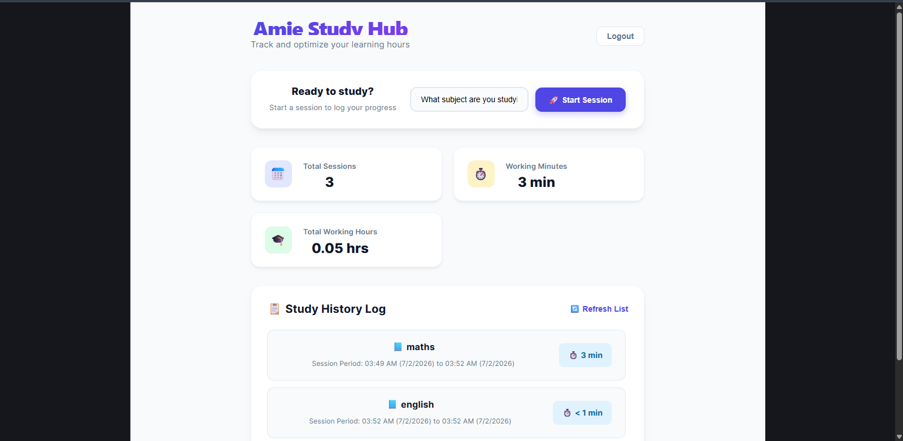
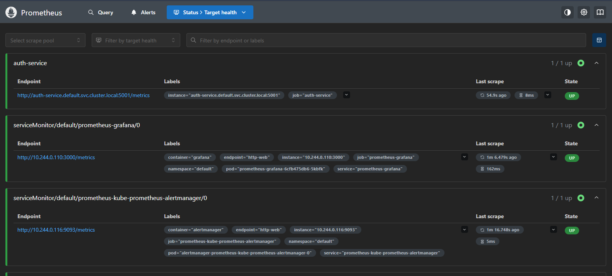
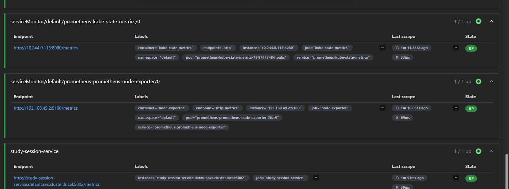
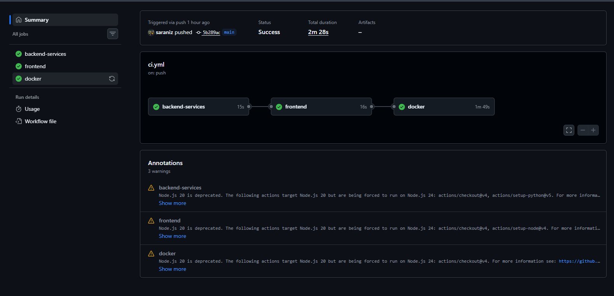

# Cloud Native CI/CD Platform

This project is a small cloud-native study tracker built in phases. The work completed in this repository covers the application, containerization, local orchestration, CI, Kubernetes deployment manifests, continuous deployment, and monitoring.

## What I built

- `auth-service`: Flask API for user registration and login.
- `studysession-tracker-service`: Flask API for starting, ending, and listing study sessions.
- `frontend`: React + Vite UI for interacting with the backend services.
- PostgreSQL database shared by the backend services.
- Docker images and a `docker-compose.yml` file for local development.
- GitHub Actions CI workflow for backend tests, frontend build, and Docker image build/push.
- Kubernetes manifests for deploying the services.
- Prometheus metrics endpoints in the backend services.
- Continuous deployment that updates the cluster after a successful pipeline run.
- Monitoring setup with Prometheus scraping service metrics and Grafana for dashboards.

## Services

### Auth Service

Location: `auth-service/`

Main endpoints:

- `POST /register`
- `POST /login`
- `GET /health`
- `GET /metrics`

### Study Session Tracker Service

Location: `studysession-tracker-service/`

Main endpoints:

- `POST /sessions/start`
- `PUT /sessions/end/<id>`
- `GET /sessions`
- `GET /health`
- `GET /metrics`

### Frontend

Location: `frontend/`

The frontend is built with React and Vite and is configured to talk to the backend services.

## Local Development

### Run with Docker Compose

```bash
docker compose up --build
```

This starts:

- PostgreSQL
- Auth service on port `5001`
- Study session service on port `5002`
- Frontend on port `3000`

### Run tests locally

Auth service:

```bash
cd auth-service
PYTHONPATH=. pytest -v
```

Study service:

```bash
cd studysession-tracker-service
PYTHONPATH=. pytest -v
```

Frontend:

```bash
cd frontend
npm install
npm run build
```

## CI

The repository includes a GitHub Actions workflow at `.github/workflows/ci.yml` that:

- checks out the code
- installs dependencies
- runs backend tests
- builds the frontend
- builds and pushes Docker images

## Continuous Deployment

The pipeline is extended to deploy the latest service images to Kubernetes after a successful build.

In practice, this means:

- Docker images are built during the pipeline.
- The updated images are pushed to the registry.
- Kubernetes resources are applied so the cluster runs the new version.

## Monitoring

The backend services expose a `/metrics` endpoint for Prometheus.

Monitoring includes:

- Prometheus scraping the auth service and study session service.
- Grafana dashboards for viewing service and cluster metrics.
- Visibility into request count, request latency, CPU, memory, and pod health.

## Screenshots

### Application Dashboard



### Prometheus Targets



### Study Service Targets



### CI Pipeline



## Kubernetes

Kubernetes manifests are stored in `k8s/` for deploying the backend services and frontend.

## Repository Structure

```text
cloud-native-ci-cd-platform/
├── auth-service/
├── frontend/
├── k8s/
├── studysession-tracker-service/
├── docker-compose.yml
└── .github/workflows/
```